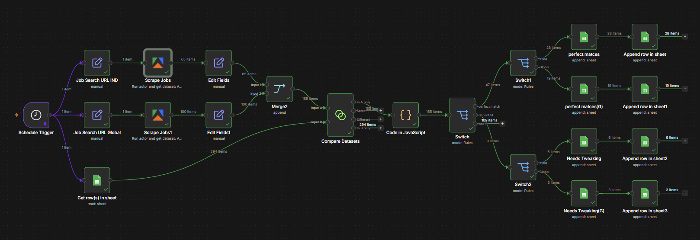

# Automated Job Scraper & Resume Scorer (n8n + Apify)

An automated serverless workflow built in **n8n** that scrapes LinkedIn for job postings, evaluates them against a customized skill matrix, filters out unqualified roles (seniority, visa requirements), and neatly organizes the best matches into Google Sheets. 

This project is designed to run autonomously on a free **Hugging Face Space** backed by a **Supabase** PostgreSQL database.

## Workflow Architecture
 

## Features
* **Automated Scraping:** Runs daily at 9:00 AM via Apify's LinkedIn Scraper to fetch the latest jobs for "AI Engineer" (split into Local/India and Global/Remote branches).
* **Smart Deduplication:** Checks incoming scraped jobs against a master Google Sheet of past Job IDs to prevent duplicate processing.
* **Algorithmic Resume Scoring:** Uses a custom JavaScript node to parse job descriptions and award points for matched technical skills (e.g., Python, RAG, LLMs, Vector Databases).
* **Auto-Rejection (Regex):** Instantly nukes the score (`-100`) if the job description mentions senior-level keywords, requires a Ph.D., asks for excessive years of experience, or explicitly requires US work authorization/visas.
* **Intelligent Routing:** Sorts jobs first by location, and then by match quality (Perfect Match, Decent Fit, Bad Fit) directly into specific Google Sheet tabs.

---

## Prerequisites
To run this workflow, you will need free accounts for the following services:
* **[Supabase](https://supabase.com/)** (PostgreSQL Database for n8n memory/execution logs)
* **[Hugging Face](https://huggingface.co/)** (Docker Space for hosting n8n)
* **[Apify](https://apify.com/)** (For the LinkedIn Scraper Actor)
* **Google Cloud Console** (To generate Google Sheets API credentials)

---

## Phase 0: Infrastructure Setup (Hosting & Memory)
This workflow is designed to run in the cloud for free using Hugging Face and Supabase.

### 1. Database (Supabase)
1. Create a free project on Supabase.
2. Navigate to **Project Settings > Database**.
3. Save your database password and copy the **Transaction Pooler** connection string (ensure it uses port `6543`).
4. Turn **OFF** "Automatically expose new tables" and **OFF** "Enable automatic RLS".

### 2. Compute Engine (Hugging Face Spaces)
1. Create a new **Docker Space** on Hugging Face.
2. In **Space Settings > Variables and Secrets**, input your Supabase credentials:
   * `DB_POSTGRESDB_HOST`
   * `DB_POSTGRESDB_USER`
   * `DB_POSTGRESDB_PASSWORD`
   * `DB_POSTGRESDB_DATABASE` = `postgres`
   * `DB_TYPE` = `postgresdb`
3. Add your n8n-specific environment variables:
   * `N8N_PORT` = `7860`
   * `N8N_ENCRYPTION_KEY` = `[generate_a_random_string]`
   * `WEBHOOK_URL` = `https://[your-space-name].hf.space`
   * `GENERIC_TIMEZONE` = `Asia/Kolkata` *(or your local timezone)*
4. Create a `Dockerfile` in the Space with the following code to pull the n8n image and expose the required port:
```dockerfile
   FROM n8nio/n8n:latest
   USER root
   RUN chown -R node:node /home/node
   USER node
   EXPOSE 7860
   ```
5. Commit the file. Hugging Face will automatically build and launch your n8n instance.

---

## Phase 1: Importing and Configuring the Workflow

### 1. Import the JSON
1. Open your hosted n8n instance.
2. Go to **Workflows > Add Workflow**.
3. Click the menu in the top right and select **Import from File**.
4. Upload the `My workflow.json` file provided in this repository.

### 2. Configure Credentials
You will need to reconnect the nodes to your personal accounts:
* **Apify Node:** Go to Apify > Settings > Integrations, copy your API Token, and add it to the n8n Apify node credentials.
* **Google Sheets Nodes:** Authenticate n8n with your Google account using OAuth2. Update the Google Sheets nodes to point to your specific Spreadsheet ID and tabs.

---

## How the Scoring Engine Works (The JS Node)
The core of this workflow is a custom JavaScript node that evaluates every single job scraped by Apify. Here is how it processes the data:

1. **Skill Matching:** It cross-references the job description against a hardcoded array of `mySkills` (e.g., Python, Langchain, Pgvector, Docker). Every matched skill adds +1 to the `score`.
2. **Experience Penalty:** It uses regular expressions (`Regex`) to hunt for phrases like "5 years of experience" or titles containing "Senior", "Lead", or "Manager". If found, the job gets flagged and the score drops to `-100`.
3. **Visa/Residency Compliance:** Because this workflow seeks remote international work, it searches the global branch for restrictive terms like "US Citizen", "H1B", "Clearance", or "Must reside in". These also drop the score to `-100`.

### Customizing the Scoring for Yourself
If you fork this repository, you should edit the JavaScript node to reflect your actual resume:
1. Open the **Code** node in n8n.
2. Locate the `mySkills` array.
3. Replace the AI/Data Engineering terms with your own tech stack, keywords, or industry jargon.

---

## License
This project is open-source and available under the MIT License. Feel free to fork, modify, and build upon this automated job-hunting infrastructure!
